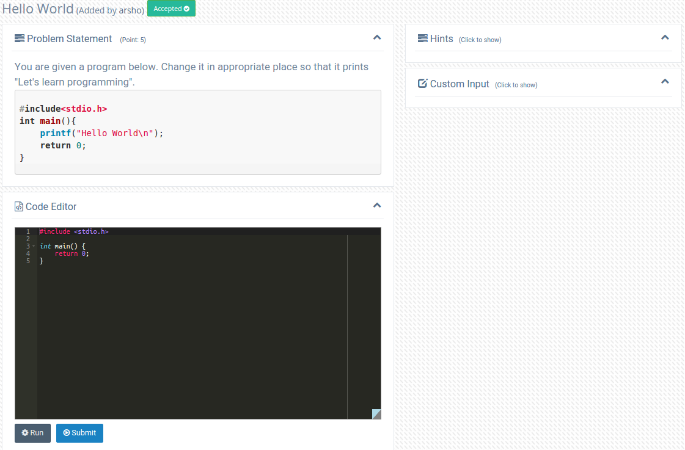
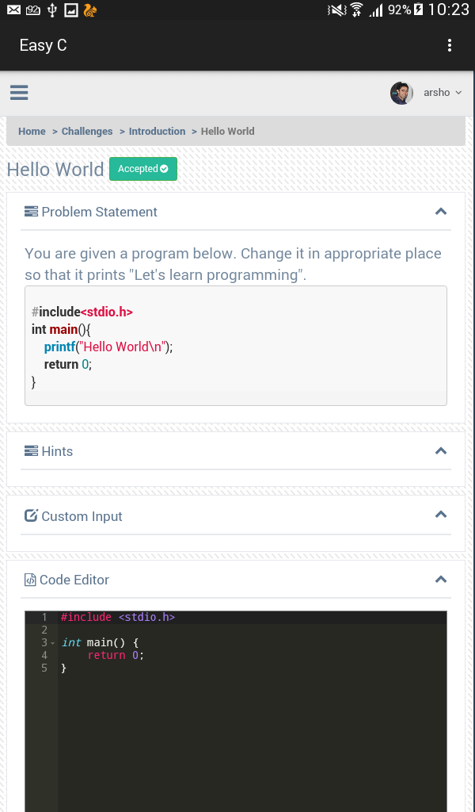

## EasyC: A new method of learning C programming
- EasyC promotes new practices and paradigms for learning C programming where the learners
have an enhanced interaction and collaboration with disciplined courseware including categorized 
lessons and challenges. 
- It provides a real time platform where learners can practice *C* 
programming language in any atmosphere using its web application or Android mobile application. 
- EasyC was our final year project. Our goal was to create a platform for young 
students to help them learn C language.

### Technologies
- PHP(MVC)
- MySQL
- jQuery
- Java (Android SDK)
- C
- Shell

### Development Team
- [Ahmedur Reahman Shovon](https://arshovon.com)
- [Nafis Sadique](https://www.linkedin.com/in/nfssdq/)
- [Md. Aslam Hossin](https://www.linkedin.com/in/md-aslam-hossin-96099692/)

### Web Application

### Mobile Application

